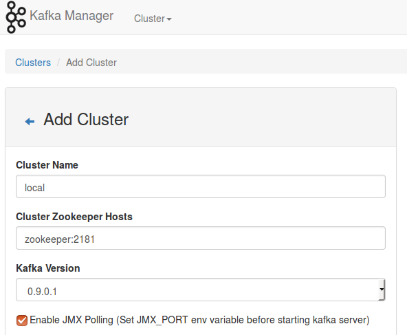
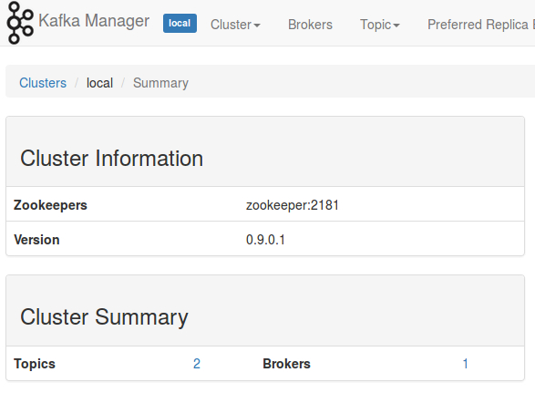

# Using Apache Kafka from Scala

This repository contains sample code that showcases how to use Kafka producers and Kafka consumers. These examples are used to demonstrate Apache Kafka as part of my talk [Apache Kafka for Fast Data Pipelines](http://mguenther.github.io/presentations/scala_rhein_main-kafka_for_fast_data_pipelines.html#/) which I gave at November, 1st 2016 for the Rhein-Main-Scala Enthusiasts Meetup.

## Prerequisities

Running the examples requires a working installation of Apache Zookeeper and Apache Kafka. This repository features Dockerfiles for both of them. Please make sure that [Docker](https://docs.docker.com/engine/installation/) as well as [Docker Compose](https://docs.docker.com/compose/install/) is installed on your system.

The Dockerfiles are heavily inspired by the excellent Dockerfiles provided by GitHub user [wurstmeister](https://github.com/wurstmeister). I mostly copied them over and changed a few bits here and there to accommodate for my needs. Thanks, wurstmeister!

### Versions

| Application         | Version | Docker Image      |
| ------------------- | ------- | ----------------- |
| Apache Kafka        | 0.9.0.1 | mgu/kafka         |
| Apache Zookeeper    | 3.4.5   | mgu/zookeeper     |
| Yahoo Kafka Manager | 1.3.1.8 | mgu/kafka-manager |

## Building and Running the Containers

Before you execute the code samples, make sure that you have a working environment running. If you have not done it already, use the script ```build-images``` to create Docker images for all required applications. Since Yahoo Kafka Manager is compiled from source, this will take a couple of minutes.

Once the images have been successfully built, you can start the resp. containers using the provided ```docker-compose``` script. Simply issue

```bash
$ docker-compose up
```

for starting Apache Kafka, Apache Zookeeper and Yahoo Kafka Manager. Stopping the containers is best done using a separate terminal and issueing the following commands.

```bash
$ docker-compose stop
$ docker-compose rm
```

The final ```rm``` operation deletes the containers and thus clears all state so you can start over with a clean installation.

In the default configuration a single Kafka broker instance is started in a separate container. It is easy to scale this to your needs. Use the following commands to scale up / down.

```bash
$ docker-compose scale kafka=3   # scales up to 3 Kafka brokers
$ docker-compose scale kafka=1   # scales down to 1 Kafka broker after the previous upscale
```

After changing the number of Kafka brokers, give the cluster some time so that all brokers can finish their cluster-join procedure. This should complete in a couple of seconds and you can inspect the output of the resp. Docker containers just to be sure that everything is fine. Kafka Manager should also reflect the change in the number of Kafka brokers after they successfully joined the cluster.

## Setting up Yahoo Kafka Manager

The Yahoo Kafka Manager needs to be configured for the local cluster before you are able to view the statistics of the cluster. Open up your browser and go to the URL ```localhost:9000``` to open up Kafka Manager. You will notice that there is no cluster configuration ready.


Click on the menu ```Cluster``` and choose ```Add cluster``` from the dropdown. Fill out the form on the next screen as the screenshot below suggests.



Click on ```Save``` at the bottom of the form and you will be redirected to the cluster overview page. All is well if the cluster overview looks like the following screenshot.



## Running the Scala-based Kafka CLI

Go to the root of the repository and issue

```bash
$ sbt run
```

This will start ```KafkaExampleCli``` which instantiates a single producer (cf. class ```ProducerWorker```) and a single consumer (cf. class ```ConsumerWorker```) and gives you a simplistic shell-like environment to dispatch messages. Type in

```
send test This is a test message.
```

to send a message to topic ```test```. You should see something along the lines of the following output:

```
19:59:51.513 ProducerWorker$: [ba6a6d0] Accepted message Message(b8779f2,This is test message.) for dispatch to topic test.
19:59:51.667 ProducerWorker$: [ba6a6d0] Send message 'Message(b8779f2,This is test message.)' to topic test.
19:59:51.706 ConsumerWorker$: [a19be40] Received payload: Message(b8779f2,This is test message.)
```

This output tells you that the producer with ID ```ba6a6d0``` has accepted and sent the message to topic ```test``` and that sometime after the consumer with ID ```a19be40``` has read that same message from topic ```test```, to which it is subscribed to.

## Code Walkthrough

* ```SimpleProducer``` and ```SimpleConsumer``` contain the minimalistic examples that I have shown during the presentation.
* A slightly more sophisticated approach is shown in classes ```ProducerWorker``` and ```ConsumerWorker```. Both of these classes are ```Runnable```s that are executed within a dedicated thread.
* A ```ProducerWorker``` requires an ```Encoder```, while a ```ConsumerWorker``` operates with a ```Decoder``` that is compatible with the ```Encoder``` of the resp. producer. To use this in a type-safe way, encoders and decoders are coupled as a ```Codec```. Have a look at ```JsonCodec``` for a JSON-based example or ```AvroCodec``` for a codec that supports bijective mappings using Avro.
* ```Settings``` contains case classes that are used to configure both producers and consumers. Keep in mind that Kafka uses default values for all other parameters that are not provided while initializing producers and consumers.

## License

This software is released under the terms of the MIT license.
