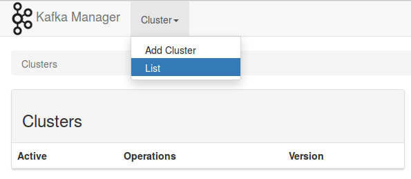

# Using Apache Kafka from Scala

This repository contains sample code that showcases how to use Kafka producers and Kafka consumers. These examples are used to demonstrate Apache Kafka as part of my talk ***Apache Kafka for Fast Data Pipelines*** which I gave at November, 1st 2016 for the Rhein-Main-Scala Enthusiasts Meetup.

## Prerequisities

Running the examples requires a working installation of Apache Zookeeper and Apache Kafka. This repository features Dockerfiles for both of them. Please make sure that [Docker](https://docs.docker.com/engine/installation/) as well as [Docker Compose](https://docs.docker.com/compose/install/) is installed on your system.

The Dockerfiles are heavily inspired by the excellent Dockerfiles provided by GitHub user [wurstmeister](https://github.com/wurstmeister). I mostly copied them over and changed a few bits here and there to accommodate for my needs. Thanks, wurstmeister!

### Versions

| Application         | Version | Docker Image      |
| ------------------- | ------- | ----------------- |
| Apache Kafka        | 0.9.0.1 | mgu/kafka         |
| Apache Zookeeper    | 3.4.5   | mgu/zookeeper     |
| Yahoo Kafka Manager | 1.3.1.8 | mgu/kafka-manager |

### Building and Running the Containers

Before you execute the code samples, make sure that you have a working environment running. If you have not done it already, use the script ```build-images``` to create Docker images for all required applications. Since Yahoo Kafka Manager is compiled from source, this will take a couple of minutes.

Once the images have been successfully built, you can start the resp. containers using the provided ```docker-compose``` script. Simply issue

```bash
$ docker-compose up
```

for starting Apache Kafka, Apache Zookeeper and Yahoo Kafka Manager. Stopping the containers is best done using a separate terminal and issueing the following commands.

```bash
$ docker-compose stop
$ docker-compose rm
```

The final ```rm``` operation deletes the containers and thus clears all state so you can start over with a clean installation.

In the default configuration a single Kafka broker instance is started in a separate container. It is easy to scale this to your needs. Use the following commands to scale up / down.

```bash
$ docker-compose scale=kafka 3   # upscales to 3 Kafka brokers
$ docker-compose scale=kafka 1   # downscales to 1 Kafka broker after the previous upscale
```

The Yahoo Kafka Manager needs to be configured for the local cluster before you are able to view the statistics of the cluster. Open up your browser and go to the URL ```localhost:9000``` to open up Kafka Manager. You will notice that there is no cluster configuration ready.



Click on the menu ```Cluster``` and choose ```Add cluster``` from the dropdown. Fill out the form on the next screen as the screenshot below suggests.


Click on ```Save``` at the bottom of the form and you will be redirected to the cluster overview page. All is well if the cluster overview looks like the following screenshot.


## License

This software is released under the terms of the MIT license.
